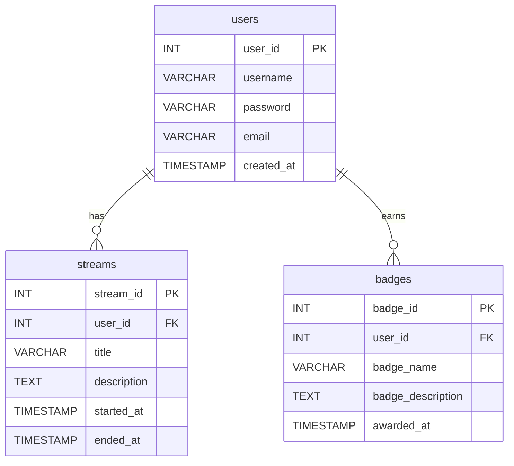

## 🔗 디자인 시안

[Figma 바로가기](https://www.figma.com/design/935lSkNY6Xe8QZRJWQZVe8/Untitled?node-id=0-1&t=nUBz2LA1dPA1aPNz-1)

# SSAFY 13기 상반기 프로젝트 기획서

## 📌 프로젝트 명

**SSAfricaTV**

## 📖 프로젝트 개요

SSAFY 교육생을 위한 실시간 운동 라이브 스트리밍 플랫폼입니다. JWT 인증, WebRTC 라이브 스트리밍, WebSocket 채팅 기능이 중심이며, 사용자 프로필에 포켓몬 테마의 뱃지를 제공합니다.

## 🎯 프로젝트 목표

| 목표        | 내용                                     |
| --------- | -------------------------------------- |
| 실시간 기술 경험 | WebRTC, WebSocket을 이용한 스트리밍 및 채팅 경험 축적 |
| 보안성 강화    | JWT를 활용한 안전한 사용자 인증 시스템 구축             |

## 🛠️ 사용 기술 스택

| 분야       | 기술 스택                                               |
| -------- | --------------------------------------------------- |
| Backend  | Spring Boot, MyBatis, JWT, WebRTC, WebSocket, Redis |
| Frontend | Vue.js, Not Human(AI 인터페이스), Poketmon CSS           |

## ✨ 주요 기능

| 기능 구분    | 상세 설명                                                 |
| -------- | ----------------------------------------------------- |
| 사용자 인증   | JWT 기반 로그인, 인증, 권한 관리                                 |
| 라이브 스트리밍 | WebRTC 활용 실시간 저지연 방송 송수신                              |
| 실시간 채팅   | WebSocket 기반 양방향 실시간 소통 (Redis 캐싱 이용, 방송 종료 시 데이터 삭제) |
| AI 인터페이스 | Not Human을 통한 자동화된 사용자 안내 및 FAQ 응답                    |
| 사용자 뱃지   | 포켓몬 테마의 뱃지 형태로 사용자 프로필 관리                             |

## 🗓️ 일정 계획

| 기간     | 작업 내용             |
| ------ | ----------------- |
| 1\~2주차 | 요구사항 분석 및 상세 기획   |
| 3\~4주차 | 시스템 설계 및 프로토타입 개발 |
| 5\~8주차 | 기능 구현 및 기술 통합     |
| 9주차    | 시스템 통합 테스트 및 디버깅  |
| 10주차   | 최종 서비스 런칭 및 시연 준비 |

## 📌 ERD 관련 DB Schema 생성 쿼리문

```sql
-- 사용자 테이블
CREATE TABLE users (
                       user_id INT PRIMARY KEY AUTO_INCREMENT,
                       username VARCHAR(50) NOT NULL,
                       password VARCHAR(255) NOT NULL,
                       email VARCHAR(100) UNIQUE NOT NULL,
                       created_at TIMESTAMP DEFAULT CURRENT_TIMESTAMP
);

-- 방송 테이블
CREATE TABLE streams (
                         stream_id INT PRIMARY KEY AUTO_INCREMENT,
                         user_id INT,
                         title VARCHAR(255) NOT NULL,
                         description TEXT,
                         started_at TIMESTAMP DEFAULT CURRENT_TIMESTAMP,
                         ended_at TIMESTAMP NULL,
                         FOREIGN KEY (user_id) REFERENCES users(user_id)
);

-- 사용자 뱃지 테이블
CREATE TABLE badges (
                        badge_id INT PRIMARY KEY AUTO_INCREMENT,
                        user_id INT,
                        badge_name VARCHAR(100),
                        badge_description TEXT,
                        awarded_at TIMESTAMP DEFAULT CURRENT_TIMESTAMP,
                        FOREIGN KEY (user_id) REFERENCES users(user_id)
);
```

### 💡 채팅 메시지 처리 방식

* Redis 사용 (메모리 캐시)
* 방송 ID별로 캐시 키 설정하여 방송 종료 시 자동 삭제
* DB 영구 저장 없음 (비용 절감 및 성능 향상 목적)

---

## 📑 RESTful API 명세서

### 1. 인증 & 사용자

| Method | Endpoint                     | 요청 본문 / URL 파라미터                 | 응답 (200)                              | 설명          |
| ------ | ---------------------------- | -------------------------------- | ------------------------------------- | ----------- |
| POST   | `/api/auth/register`         | `{ username, email, password }`  | `{ userId }`                          | 회원가입        |
| POST   | `/api/auth/login`            | `{ email, password }`            | `{ accessToken, refreshToken }` (JWT) | 로그인         |
| GET    | `/api/users/{userId}`        | path param                       | `UserDTO`                             | 사용자 상세 조회   |
| PUT    | `/api/users/{userId}`        | `{ username, email, password? }` | `UserDTO`                             | 프로필 수정      |
| GET    | `/api/users/{userId}/badges` | path param                       | `[ BadgeDTO ]`                        | 보유 뱃지 목록 조회 |

### 2. 스트리밍

| Method | Endpoint                      | 요청 본문 / URL 파라미터             | 응답 (200)        | 설명                  |
| ------ | ----------------------------- | ---------------------------- | --------------- | ------------------- |
| GET    | `/api/streams`                | query: `status(live/ended)`? | `[ StreamDTO ]` | 스트림 목록              |
| POST   | `/api/streams`                | `{ title, description }`     | `StreamDTO`     | 스트림 생성 (방송 시작)      |
| GET    | `/api/streams/{streamId}`     | path param                   | `StreamDTO`     | 스트림 상세              |
| PATCH  | `/api/streams/{streamId}/end` | path param                   | `StreamDTO`     | 방송 종료(ended\_at 세팅) |

### 3. 채팅 (WebSocket)

\| 연결 | `ws://<host>/ws/chat?streamId={streamId}&token={accessToken}` |
\| 메시지 구조 | `{ "type": "CHAT", "content": "메시지 내용" }` |
\| 서버 응답 | `{ "type": "CHAT", "sender": "username", "content": "...", "sentAt": "ISO8601" }` |

> 채팅 이력은 Redis에 스트림 ID별로 임시 저장되며, 스트림 종료 시 자동 삭제됩니다.

### 4. 뱃지 관리 (Admin/Internal)

| Method | Endpoint                     | 요청 본문                             | 응답 (200)   | 설명          |
| ------ | ---------------------------- | --------------------------------- | ---------- | ----------- |
| POST   | `/api/users/{userId}/badges` | `{ badgeName, badgeDescription }` | `BadgeDTO` | 사용자에게 뱃지 부여 |

### DTO 예시

```jsonc
// UserDTO
{
  "userId": 1,
  "username": "pikachu",
  "email": "pikachu@ssafrica.tv",
  "createdAt": "2025-05-02T12:00:00Z"
}

// StreamDTO
{
  "streamId": 100,
  "userId": 1,
  "title": "알고리즘 스터디 라이브",
  "description": "다익스트라 풀이 설명합니다",
  "startedAt": "2025-05-02T12:30:00Z",
  "endedAt": null
}

// BadgeDTO
{
  "badgeId": 5,
  "userId": 1,
  "badgeName": "Bug Catcher",
  "badgeDescription": "첫 방송 달성",
  "awardedAt": "2025-05-10T09:00:00Z"
}
```



## 📁 프로젝트 폴더 구조 전략
```markdown
src
├── main
│   ├── java
│   │   └── com/jmjg/ssafitv
│   │       ├── common
│   │       │   ├── config
│   │       │   ├── exception
│   │       │   ├── security
│   │       │   ├── util
│   │       │   ├── dto                # 정말 공통으로 쓰이는 DTO만!
│   │       │   │   └── ApiResponse.java
│   │       │   └── service            # 도메인 간 중복 로직·유틸 서비스
│   │       │       ├── EmailService.java
│   │       │       └── NotificationService.java
│   │       └── domain
│   │           ├── user
│   │           │   ├── api
│   │           │   │   └── UserController.java
│   │           │   ├── dto            # user 전용 DTO
│   │           │   │   ├── UserCreateRequest.java
│   │           │   │   └── UserResponse.java
│   │           │   ├── service        # 비즈니스 로직
│   │           │   │   └── UserService.java
│   │           │   └── persistence
│   │           │       ├── entity
│   │           │       │   └── UserEntity.java
│   │           │       └── mapper
│   │           │           ├── UserMapper.java
│   │           │           └── UserMapper.xml
│   │           ├── stream
│   │           │   ├── api
│   │           │   │   └── StreamController.java
│   │           │   ├── dto            # stream 전용 DTO
│   │           │   │   ├── StreamCreateRequest.java
│   │           │   │   └── StreamResponse.java
│   │           │   ├── service
│   │           │   │   └── StreamService.java
│   │           │   └── persistence
│   │           │       ├── entity
│   │           │       │   └── StreamEntity.java
│   │           │       └── mapper
│   │           │           ├── StreamMapper.java
│   │           │           └── StreamMapper.xml
│   │           └── badge
│   │               ├── api
│   │               │   └── BadgeController.java
│   │               ├── dto            # badge 전용 DTO
│   │               │   ├── BadgeAssignRequest.java
│   │               │   └── BadgeResponse.java
│   │               ├── service
│   │               │   └── BadgeService.java
│   │               └── persistence
│   │                   ├── entity
│   │                   │   └── BadgeEntity.java
│   │                   └── mapper
│   │                       ├── BadgeMapper.java
│   │                       └── BadgeMapper.xml
│   └── resources
│       ├── application.yml
│       ├── application-dev.yml       # profile 별 분리
│       ├── application-prod.yml
│       └── db
│           └── init.sql
└── test
    └── java
        └── com/jmjg/ssafitv
            ├── domain
            │   ├── user
            │   ├── stream
            │   └── badge
            └── common
```

## 📝 Git 커밋 컨벤션

| 말머리 | 설명 |
|----------|--------------------------------------|
| feat | 새로운 기능 추가 |
| fix | 버그 수정 |
| refactor | 코드 리팩토링 (기능 변화 없음) |
| del | 파일 삭제 |
| perf | 성능 개선 |
| style | 코드 스타일/포맷팅 (공백, 세미콜론 등)|
| docs | 문서/주석 추가 및 수정 |
| test | 테스트 코드 추가/수정 |
| chore | 빌드, 패키지, 환경설정 등 기타 작업 |
| ui | UI/UX 개선, 레이아웃/스타일 변경 |

### 예시
```markdown
[feat] 실시간 채팅 WebSocket 연동
[fix] 로그인 시 JWT 토큰 갱신 오류 수정
[ui] 방송 시작 버튼 애니메이션 개선
[docs] ERD 및 API 명세 추가
```

## 🌿 브랜치 전략
- main: 실제 서비스 배포(운영) 브랜치
- dev: 통합 개발 브랜치 (모든 기능/버그/리팩토링은 여기로 merge)
- feat/기능명: 새로운 기능 개발용 브랜치
- 예) feat/login, feat/webrtc-stream
- fix/버그명: 버그 수정 브랜치
- 예) fix/login-error
- hotfix/이슈명: 운영 긴급 수정 브랜치
- 예) hotfix/prod-crash
- release/버전명: 배포 준비 브랜치
- 예) release/v1.0.0
- PR/머지 규칙
- 기능/버그 브랜치 → develop로 PR
- release 브랜치 → main으로 PR (배포)
- main에서 hotfix 필요시 hotfix 브랜치 생성 후 main, develop에 모두 머지

<p align="center">
  <a href="http://nestjs.com/" target="blank"></a>
</p>

[circleci-image]: https://img.shields.io/circleci/build/github/nestjs/nest/master?token=abc123def456
[circleci-url]: https://circleci.com/gh/nestjs/nest

  <p align="center">A progressive <a href="http://nodejs.org" target="_blank">Node.js</a> framework for building efficient and scalable server-side applications.</p>
    <p align="center">
<a href="https://www.npmjs.com/~nestjscore" target="_blank"></a>
<a href="https://www.npmjs.com/~nestjscore" target="_blank"></a>
<a href="https://www.npmjs.com/~nestjscore" target="_blank"></a>
<a href="https://circleci.com/gh/nestjs/nest" target="_blank"></a>
<a href="https://coveralls.io/github/nestjs/nest?branch=master" target="_blank"></a>
<a href="https://discord.gg/G7Qnnhy" target="_blank"></a>
<a href="https://opencollective.com/nest#backer" target="_blank"></a>
<a href="https://opencollective.com/nest#sponsor" target="_blank"></a>
  <a href="https://paypal.me/kamilmysliwiec" target="_blank"></a>
    <a href="https://opencollective.com/nest#sponsor"  target="_blank"></a>
  <a href="https://twitter.com/nestframework" target="_blank"></a>
</p>
  <!--[](https://opencollective.com/nest#backer)
  [](https://opencollective.com/nest#sponsor)-->

## Description

[Nest](https://github.com/nestjs/nest) framework TypeScript starter repository.

## Installation

```bash
$ yarn install
```

## Running the app

```bash
# development
$ yarn run start

# watch mode
$ yarn run start:dev

# production mode
$ yarn run start:prod
```

## Test

```bash
# unit tests
$ yarn run test

# e2e tests
$ yarn run test:e2e

# test coverage
$ yarn run test:cov
```

## Support

Nest is an MIT-licensed open source project. It can grow thanks to the sponsors and support by the amazing backers. If you'd like to join them, please [read more here](https://docs.nestjs.com/support).

## Stay in touch

- Author - [Kamil Myśliwiec](https://kamilmysliwiec.com)
- Website - [https://nestjs.com](https://nestjs.com/)
- Twitter - [@nestframework](https://twitter.com/nestframework)

## License

Nest is [MIT licensed](LICENSE).
